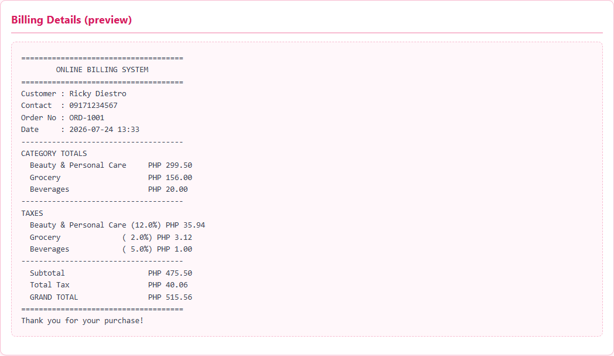

# Online Billing System — Step-by-Step Documentation

**Course:** Elective 3
**Project:** Online Billing System
**Stack:** PHP (OOP) · MySQL · HTML5 · CSS3 · JavaScript · XAMPP

Ang dokumentong ito ay hakbang-hakbang na patunay na gumagana ang buong system.
Bawat screenshot dito ay kinuha mula sa **aktwal na tumatakbong aplikasyon** sa
`http://localhost/Diestro_Ricky/OnlineBillingSystem/`.

---

## Step 1 — Main Interface

Pagbukas ng system, awtomatikong kinukuha mula sa MySQL database ang lahat ng
produkto at nakagrupo ayon sa kategorya: **Beauty & Personal Care**, **Grocery**,
at **Beverages**.

---

## Step 2 — Find a Customer (Input)

Sa **Customer Details**, maaaring maghanap ng existing customer gamit ang
**Contact Number** o **Order Number**. Dito, inilagay ang `09171234567`.

---

## Step 3 — Find Result (Auto-fill)

Matapos i-click ang **Find**, awtomatikong lumabas ang buong impormasyon ng
customer mula sa database — `Ricky Diestro`, `09171234567`, `ORD-1001`.

---

## Step 4 — Enter Quantities

Naglagay ng quantity (Integer lamang) sa iba't ibang kategorya:
Facial Cleanser ×2, Rice ×3, Mineral Water ×1.

---

## Step 5 — Total (Category Totals)

Pag-click sa **Total**, kinakalkula ang kabuuan bawat kategorya at ipinapakita sa
**Bill Transactions** kasama ang taxes, subtotal, total tax, at grand total.

| Field | Halaga |
|-------|--------|
| Beauty & Personal Care Total | ₱299.50 |
| Grocery Total | ₱156.00 |
| Beverages Total | ₱20.00 |
| Subtotal | ₱475.50 |
| Total Tax | ₱40.06 |
| **Grand Total** | **₱515.56** |

---

## Step 6 — Bill (Save Order)

Pag-click sa **Bill**, iniimbak ang transaksyon sa database (`orders` at
`order_items`). Lumalabas ang kumpirmasyon na **"Bill saved. Order #1"**.

---

## Step 7 — E-Mail / Receipt Preview

Ang **E-Mail** button ay bumubuo ng malinis na billing receipt na maaaring
ipakita o ipadala. Makikita ang kompletong breakdown ng bawat kategorya, tax
rate, at grand total.

---

## Step 8 — Print

Ang **Print** button ay naglalabas ng printable receipt. Nakalakip din ang
na-generate na PDF: [`08-print-receipt.pdf`](08-print-receipt.pdf).

---

## Step 9 — Clear (Reset)

Ang **Clear** button ay nire-reset ang lahat ng field, quantity, at computation
pabalik sa ₱0.00 para sa bagong transaksyon.

---

## Step 10 — Database Verification (phpMyAdmin)

Panghuli, kumpirmado sa database na naka-save nga ang transaksyon. Ipinapakita ng
`orders` table ang Order #1 na may subtotal ₱475.50, total tax ₱40.06, at grand
total ₱515.56 — tugmang-tugma sa receipt sa Step 7.

---

### Notes

- Lahat ng computation (subtotal, tax bawat kategorya, grand total) ay ginagawa
  sa server-side gamit ang OOP PHP classes (`Bill`, `Order`, `Product`,
  `Customer`).
- Ang data ay tunay na naka-persist sa MySQL — napatunayan sa Step 10.
- Screenshots generated via automated capture ng aktwal na app (`capture.mjs`).
