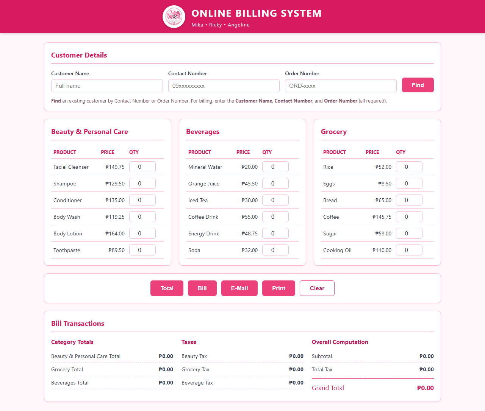
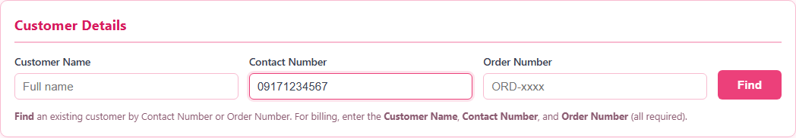
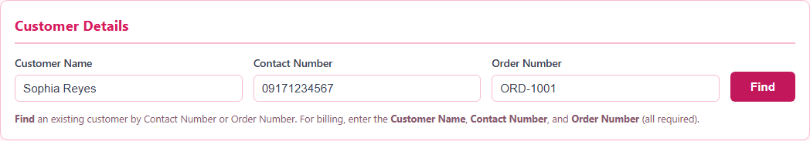
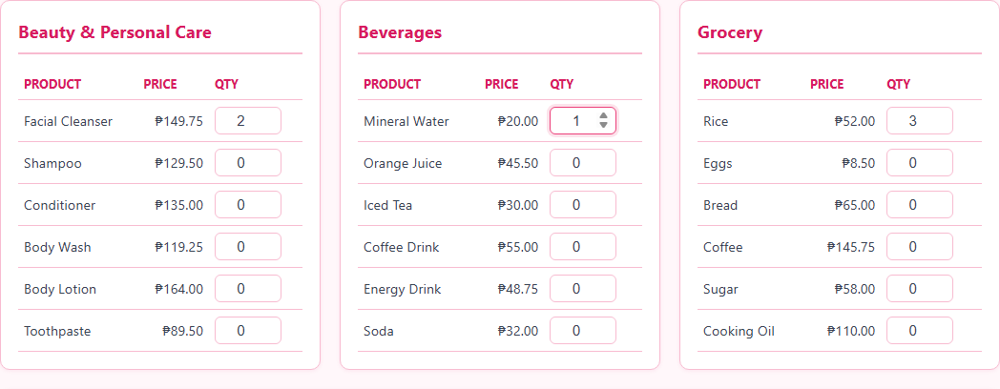
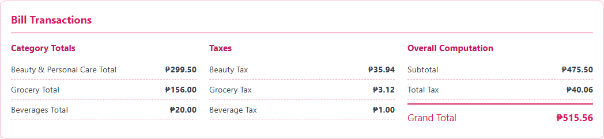
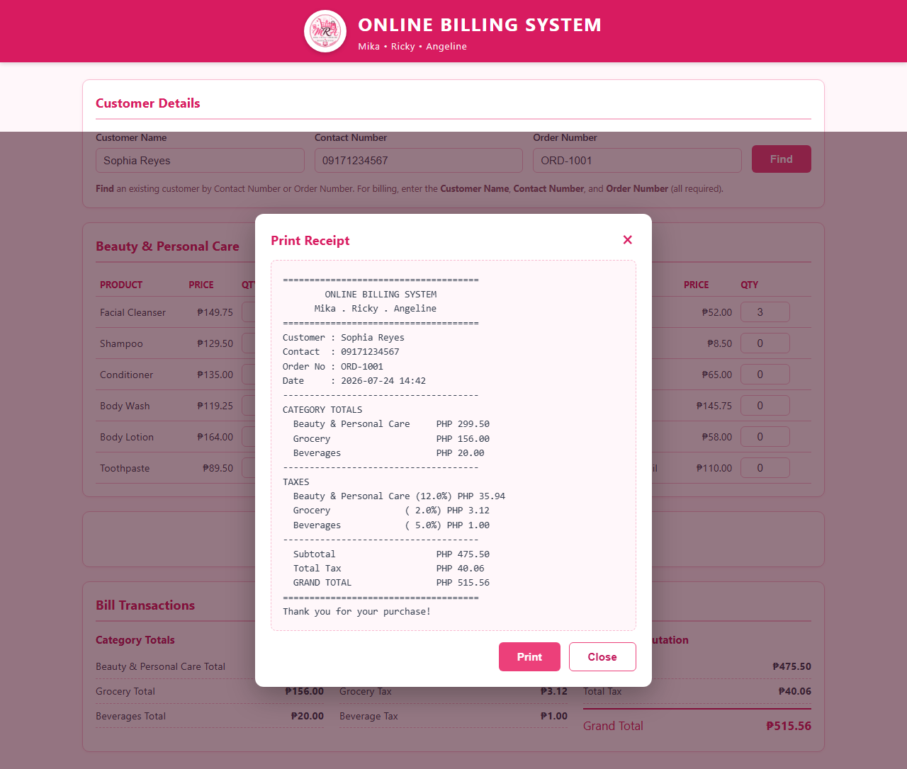
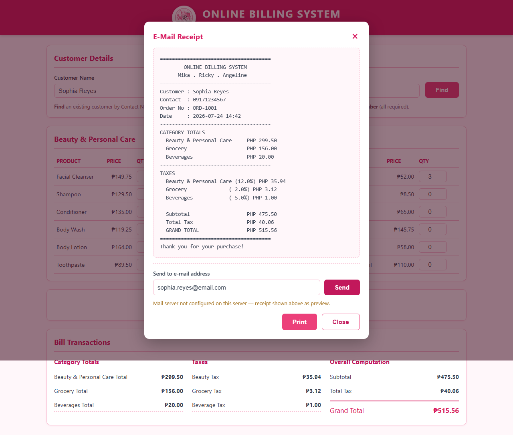
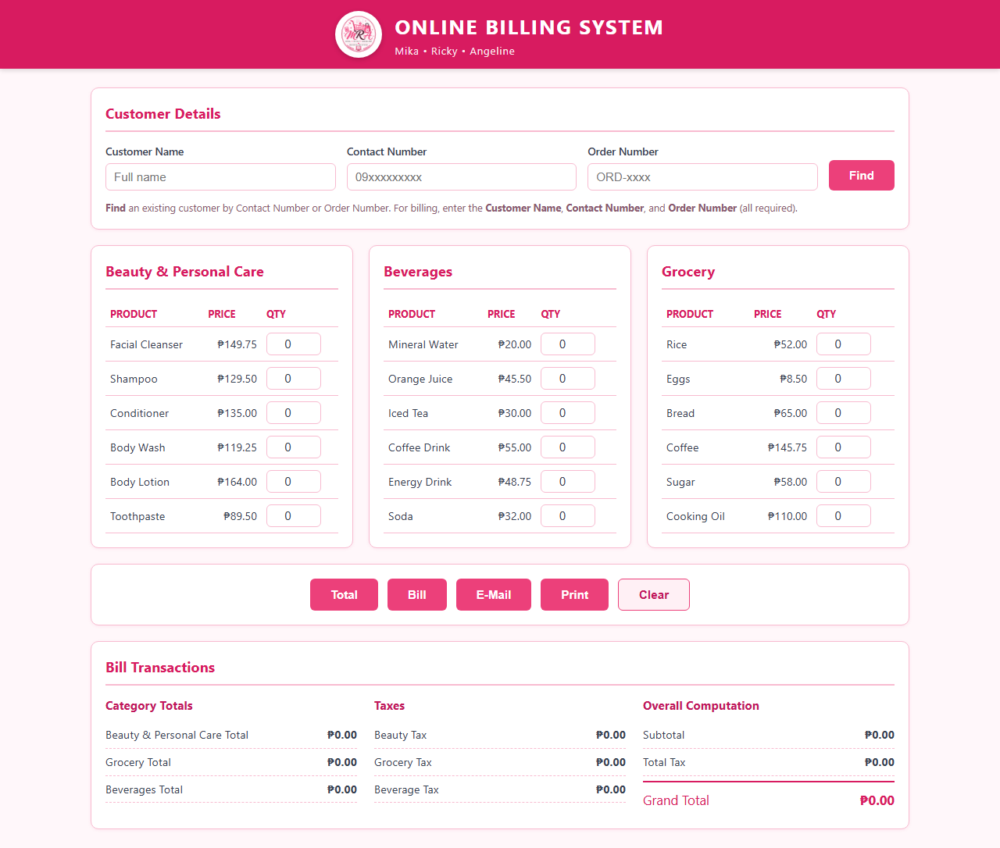
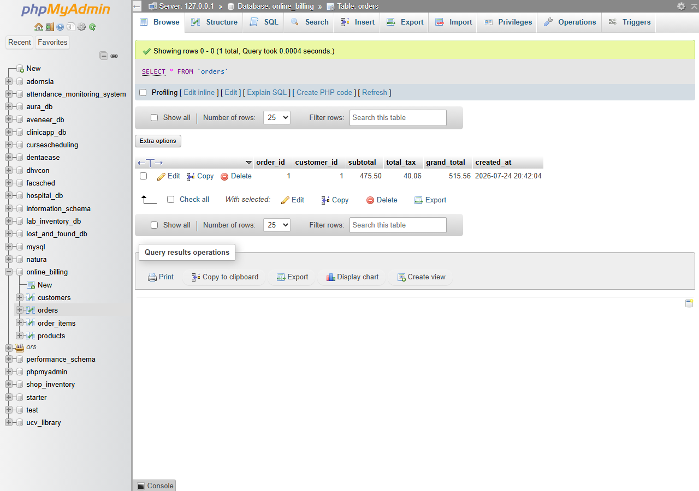
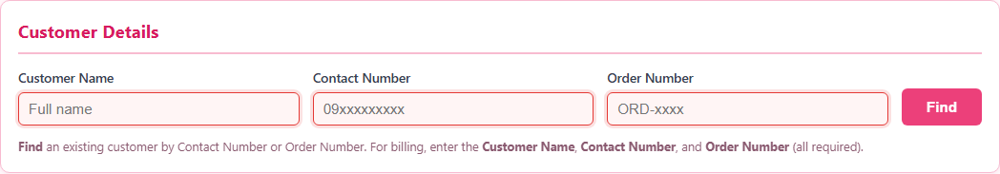

# Online Billing System — Step-by-Step Documentation

**Course:** Elective 3
**Project:** Online Billing System (MRA — Mika · Ricky · Angeline)
**Stack:** PHP (OOP) · MySQL · HTML5 · CSS3 · JavaScript · XAMPP

Ang dokumentong ito ay hakbang-hakbang na patunay na gumagana ang buong system.
Bawat screenshot dito ay kinuha mula sa **aktwal na tumatakbong aplikasyon** sa
`http://localhost/Diestro_Ricky/OnlineBillingSystem/`.

> **Reference:** Ang layout ng system ay nakabatay sa istruktura ng sample na
> ibinigay ng professor (tingnan ang [`professor-sample-layout.png`](professor-sample-layout.png)) —
> customer details → 3 categories → buttons → bill transactions.

---

## Step 1 — Main Interface

Pagbukas ng system, awtomatikong kinukuha mula sa MySQL database ang lahat ng
produkto, nakagrupo sa tatlong kategorya: **Beauty & Personal Care**, **Grocery**,
at **Beverages**.

---

## Step 2 — Find a Customer (Input)

Sa **Customer Details**, maghahanap ng existing customer gamit ang **Contact
Number** o **Order Number**. Dito, inilagay ang `09171234567`.

---

## Step 3 — Find Result (Auto-fill)

Matapos i-click ang **Find**, awtomatikong lumabas ang buong impormasyon ng
customer mula sa database — `Sophia Reyes`, `09171234567`, `ORD-1001`.

---

## Step 4 — Enter Quantities (Validated)

Naglagay ng quantity sa bawat kategorya: Facial Cleanser ×2, Rice ×3, Mineral
Water ×1. **Integer lamang** ang tinatanggap — hindi puwedeng letra, negatibo, o
decimal (naka-block sa keyboard at sanitized).

---

## Step 5 — Total (Category Totals)

Pag-click sa **Total**, kinakalkula ang kabuuan bawat kategorya at ipinapakita sa
**Bill Transactions** kasama ang taxes, subtotal, total tax, at grand total.

| Field | Halaga |
|-------|--------|
| Beauty & Personal Care Total | ₱299.50 |
| Grocery Total | ₱156.00 |
| Beverages Total | ₱20.00 |
| Subtotal | ₱475.50 |
| Total Tax | ₱40.06 |
| **Grand Total** | **₱515.56** |

---

## Step 6 — Bill (Save Order)

Pag-click sa **Bill**, iniimbak ang transaksyon sa database (`orders` at
`order_items`). Lumalabas ang kumpirmasyon na **"Bill saved. Order #1"**.

---

## Step 7 — Print (Pop-up Receipt)

Ang **Print** ay nagbubukas ng **pop-up receipt preview** (modal) — hindi hiwalay
na page. May **Print** button sa loob na maglalabas lamang ng resibo sa printer.

Nakalakip ang na-generate na printable PDF: [`07b-print-receipt.pdf`](07b-print-receipt.pdf).

---

## Step 8 — E-Mail (Send / Preview)

Ang **E-Mail** ay nagpapakita ng resibo sa pop-up, may field para sa e-mail address
at **Send** button. Kung may naka-configure na mail server, aktwal na ipapadala;
kung wala (gaya ng stock XAMPP), lalabas ito bilang **preview** — malinaw na
naka-indicate sa status message.

---

## Step 9 — Clear (Reset)

Ang **Clear** ay nire-reset ang lahat ng field, quantity, at computation pabalik
sa ₱0.00 para sa bagong transaksyon.

---

## Step 10 — Database Verification (phpMyAdmin)

Kumpirmado sa database na naka-save nga ang transaksyon. Ipinapakita ng `orders`
table ang Order #1 na may subtotal ₱475.50, total tax ₱40.06, at grand total
₱515.56 — tugmang-tugma sa resibo sa Step 7 at 8.

---

## Bonus — Inline Validation

Sa halip na basic na popup, ang mga kulang na required field ay **naka-highlight
ng pula** na may malinaw na mensahe. Nawawala ito agad pagka-type ng user.

---

### Feature Checklist (per requirements)

- [x] **UI** — malapit sa sample layout ng professor, polished spacing/alignment
- [x] **Find** — search via Contact Number o Order Number
- [x] **Total** — auto-compute ng total per category
- [x] **Bill** — taxes, subtotal, total tax, grand total (naka-save sa DB)
- [x] **Print** — pop-up receipt preview bago mag-print (hindi hiwalay na page)
- [x] **E-Mail** — actual send kung may mail server; kung wala, preview
- [x] **Clear** — reset lahat ng fields at quantities
- [x] **Bill Transactions** — Subtotal, Total Tax, Grand Total naka-display
- [x] **Validation** — numbers lang; walang negative o letters
- [x] **Responsive** — umaayos sa mobile/tablet/desktop

### Notes

- Lahat ng computation ay server-side gamit ang OOP PHP classes (`Bill`, `Order`,
  `Product`, `Customer`).
- Ang data ay tunay na naka-persist sa MySQL — napatunayan sa Step 10.
- Screenshots generated via automated capture ng aktwal na app (`capture.mjs`).
